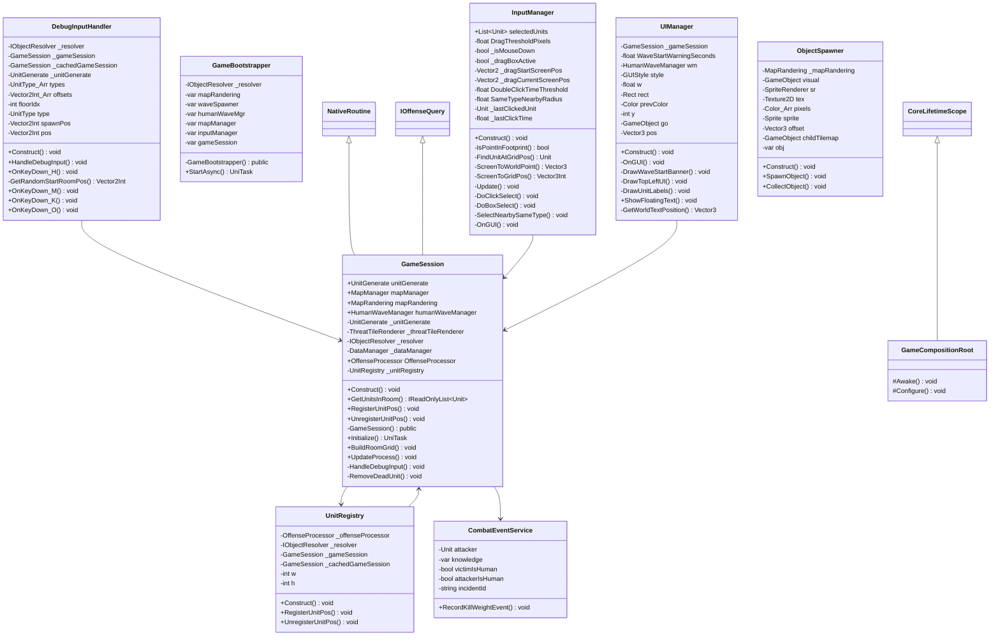

# Package `Unit/Session` UML Class Diagram

**소스 경로:** `Assets/Unit/Session`

### 📋 스크립트 클래스 명세

#### `CombatEventService` (class)
- **경로:** `Script/Unit/Session/CombatEventService.cs`
- **변수/프로퍼티:**
  - `-Unit attacker`
  - `-var knowledge`
  - `-bool victimIsHuman`
  - `-bool attackerIsHuman`
  - `-string incidentId`
- **함수:**
  - `+RecordKillWeightEvent() void`

#### `DebugInputHandler` (class)
- **경로:** `Script/Unit/Session/DebugInputHandler.cs`
- **변수/프로퍼티:**
  - `-IObjectResolver _resolver`
  - `-GameSession _gameSession`
  - `-GameSession _cachedGameSession`
  - `-UnitGenerate _unitGenerate`
  - `-UnitType_Arr types`
  - `-Vector2Int_Arr offsets`
  - `-int floorIdx`
  - `-UnitType type`
  - `-Vector2Int spawnPos`
  - `-Vector2Int pos`
  - `-Human human`
  - `-CreateMap mapGenerator`
  - `-Floor floor`
  - `-List~Vector2Int~ candidates`
  - `-int chunkW`
- **함수:**
  - `+Construct() void`
  - `+HandleDebugInput() void`
  - `+OnKeyDown_H() void`
  - `-GetRandomStartRoomPos() Vector2Int`
  - `+OnKeyDown_M() void`
  - `+OnKeyDown_K() void`
  - `+OnKeyDown_O() void`

#### `GameBootstrapper` (class)
- **경로:** `Script/Unit/Session/GameBootstrapper.cs`
- **상속/인터페이스:** `IAsyncStartable`
- **변수/프로퍼티:**
  - `-IObjectResolver _resolver`
  - `-var mapRandering`
  - `-var waveSpawner`
  - `-var humanWaveMgr`
  - `-var mapManager`
  - `-var inputManager`
  - `-var gameSession`
- **함수:**
  - `-GameBootstrapper() public`
  - `+StartAsync() UniTask`

#### `GameCompositionRoot` (class)
- **경로:** `Script/Unit/Session/GameCompositionRoot.cs`
- **상속/인터페이스:** `CoreLifetimeScope`
- **함수:**
  - `#Awake() void`
  - `#Configure() void`

#### `GameSession` (class)
- **경로:** `Script/Unit/Session/GameSession.cs`
- **상속/인터페이스:** `NativeRoutine, IOffenseQuery`
- **변수/프로퍼티:**
  - `+UnitGenerate unitGenerate`
  - `+MapManager mapManager`
  - `+MapRandering mapRandering`
  - `+HumanWaveManager humanWaveManager`
  - `-UnitGenerate _unitGenerate`
  - `-ThreatTileRenderer _threatTileRenderer`
  - `-IObjectResolver _resolver`
  - `-DataManager _dataManager`
  - `+OffenseProcessor OffenseProcessor`
  - `-UnitRegistry _unitRegistry`
  - `-ObjectSpawner _objectSpawner`
  - `-PartyService _partyService`
  - `-CombatEventService _combatEventService`
  - `-DebugInputHandler _debugInputHandler`
  - `-List~Unit~ result`
- **함수:**
  - `+Construct() void`
  - `+GetUnitsInRoom() IReadOnlyList~Unit~`
  - `+RegisterUnitPos() void`
  - `+UnregisterUnitPos() void`
  - `-GameSession() public`
  - `+Initialize() UniTask`
  - `+BuildRoomGrid() void`
  - `+UpdateProcess() void`
  - `-HandleDebugInput() void`
  - `-RemoveDeadUnit() void`
  - `-FindNearbyFreeObjectTile() Vector3Int`
  - `-ClearPerceptionRecordsFor() void`
  - `+DespawnUnit() void`
  - `+CreateParty() Party`
  - `-CheckPartyWaveState() void`

#### `InputManager` (class)
- **경로:** `Script/Unit/Session/InputManager.cs`
- **상속/인터페이스:** `MonoBehaviour`
- **변수/프로퍼티:**
  - `+List~Unit~ selectedUnits`
  - `-float DragThresholdPixels`
  - `-bool _isMouseDown`
  - `-bool _dragBoxActive`
  - `-Vector2 _dragStartScreenPos`
  - `-Vector2 _dragCurrentScreenPos`
  - `-float DoubleClickTimeThreshold`
  - `-float SameTypeNearbyRadius`
  - `-Unit _lastClickedUnit`
  - `-float _lastClickTime`
  - `-UnitGenerate _unitGenerate`
  - `-GameSession _gameSession`
  - `-BuildingManager _buildingManager`
  - `-ResourceManager _resourceManager`
  - `+bool isBuildMode`
- **함수:**
  - `+Construct() void`
  - `-IsPointInFootprint() bool`
  - `-FindUnitAtGridPos() Unit`
  - `-ScreenToWorldPoint() Vector3`
  - `-ScreenToGridPos() Vector3Int`
  - `-Update() void`
  - `-DoClickSelect() void`
  - `-DoBoxSelect() void`
  - `-SelectNearbySameType() void`
  - `-OnGUI() void`
  - `-GetGUIRect() Rect`
  - `-DrawRectBorder() void`
  - `-EnterBuildMode() void`
  - `-ExitBuildMode() void`
  - `-UpdateBuildMode() void`

#### `ObjectSpawner` (class)
- **경로:** `Script/Unit/Session/ObjectSpawner.cs`
- **변수/프로퍼티:**
  - `-MapRandering _mapRandering`
  - `-GameObject visual`
  - `-SpriteRenderer sr`
  - `-Texture2D tex`
  - `-Color_Arr pixels`
  - `-Sprite sprite`
  - `-Vector3 offset`
  - `-GameObject childTilemap`
  - `-var obj`
- **함수:**
  - `+Construct() void`
  - `+SpawnObject() void`
  - `+CollectObject() void`

#### `UIManager` (class)
- **경로:** `Script/Unit/Session/UIManager.cs`
- **상속/인터페이스:** `MonoBehaviour`
- **변수/프로퍼티:**
  - `-GameSession _gameSession`
  - `-float WaveStartWarningSeconds`
  - `-HumanWaveManager wm`
  - `-GUIStyle style`
  - `-float w`
  - `-Rect rect`
  - `-Color prevColor`
  - `-int y`
  - `-GameObject go`
  - `-Vector3 pos`
  - `-TextMesh text`
  - `-MeshRenderer mr`
- **함수:**
  - `+Construct() void`
  - `-OnGUI() void`
  - `-DrawWaveStartBanner() void`
  - `-DrawTopLeftUI() void`
  - `-DrawUnitLabels() void`
  - `+ShowFloatingText() void`
  - `-GetWorldTextPosition() Vector3`

#### `UnitRegistry` (class)
- **경로:** `Script/Unit/Session/UnitRegistry.cs`
- **변수/프로퍼티:**
  - `-OffenseProcessor _offenseProcessor`
  - `-IObjectResolver _resolver`
  - `-GameSession _gameSession`
  - `-GameSession _cachedGameSession`
  - `-int w`
  - `-int h`
  - `-int w`
  - `-int h`
- **함수:**
  - `+Construct() void`
  - `+RegisterUnitPos() void`
  - `+UnregisterUnitPos() void`

