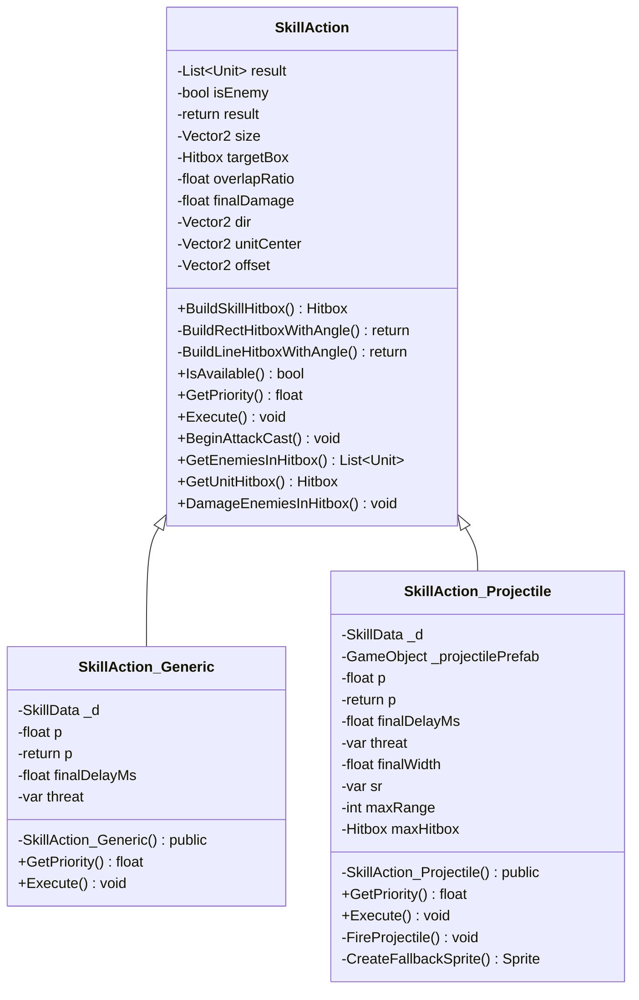

# Package `Unit/Skills` UML Class Diagram

**소스 경로:** `Assets/Unit/Skills`

### 📋 스크립트 클래스 명세

#### `SkillAction` (class)
- **경로:** `Script/Unit/Skills/SkillAction.cs`
- **변수/프로퍼티:**
  - `-List~Unit~ result`
  - `-bool isEnemy`
  - `-return result`
  - `-Vector2 size`
  - `-Hitbox targetBox`
  - `-float overlapRatio`
  - `-float finalDamage`
  - `-Hitbox targetBox`
  - `-float overlapRatio`
  - `-float finalDamage`
  - `-Vector2 dir`
  - `-Vector2 unitCenter`
  - `-Vector2 offset`
  - `-Vector2 center`
  - `-bool isHorizontal`
- **함수:**
  - `+BuildSkillHitbox() Hitbox`
  - `-BuildRectHitboxWithAngle() return`
  - `-BuildLineHitboxWithAngle() return`
  - `+IsAvailable() bool`
  - `+GetPriority() float`
  - `+Execute() void`
  - `+BeginAttackCast() void`
  - `+GetEnemiesInHitbox() List~Unit~`
  - `+GetUnitHitbox() Hitbox`
  - `+DamageEnemiesInHitbox() void`
  - `+DamageEnemiesInHitboxWithAreaRatio() void`
  - `+DamageMagicalEnemiesInHitboxWithAreaRatio() void`
  - `+BuildLineHitbox() Hitbox`
  - `+BuildLineHitboxWithAngle() Hitbox`
  - `+BuildRectHitbox() Hitbox`

#### `SkillAction_Generic` (class)
- **경로:** `Script/Unit/Skills/SkillAction_Generic.cs`
- **상속/인터페이스:** `SkillAction`
- **변수/프로퍼티:**
  - `-SkillData _d`
  - `-float p`
  - `-return p`
  - `-float finalDelayMs`
  - `-var threat`
- **함수:**
  - `-SkillAction_Generic() public`
  - `+GetPriority() float`
  - `+Execute() void`

#### `SkillAction_Projectile` (class)
- **경로:** `Script/Unit/Skills/SkillAction_Projectile.cs`
- **상속/인터페이스:** `SkillAction`
- **변수/프로퍼티:**
  - `-SkillData _d`
  - `-GameObject _projectilePrefab`
  - `-float p`
  - `-return p`
  - `-float finalDelayMs`
  - `-var threat`
  - `-float finalWidth`
  - `-var sr`
  - `-int maxRange`
  - `-Hitbox maxHitbox`
  - `-List~Unit~ enemies`
  - `-float minHitDist`
  - `-Vector2 unitCenter`
  - `-Vector2 forward`
  - `-Hitbox enemyBox`
- **함수:**
  - `-SkillAction_Projectile() public`
  - `+GetPriority() float`
  - `+Execute() void`
  - `-FireProjectile() void`
  - `-CreateFallbackSprite() Sprite`

