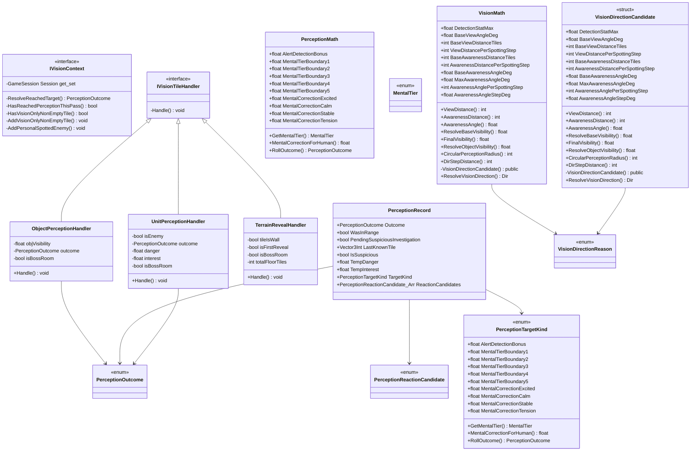

# Package `Unit/Vision` UML Class Diagram

**소스 경로:** `Assets/Unit/Vision`

### 📋 스크립트 클래스 명세

#### `IVisionContext` (interface)
- **경로:** `Script/Unit/Vision/IVisionContext.cs`
- **변수/프로퍼티:**
  - `-GameSession Session get_set`
- **함수:**
  - `-ResolveReachedTarget() PerceptionOutcome`
  - `-HasReachedPerceptionThisPass() bool`
  - `-HasVisionOnlyNonEmptyTile() bool`
  - `-AddVisionOnlyNonEmptyTile() void`
  - `-AddPersonalSpottedEnemy() void`

#### `IVisionTileHandler` (interface)
- **경로:** `Script/Unit/Vision/IVisionTileHandler.cs`
- **함수:**
  - `-Handle() void`

#### `ObjectPerceptionHandler` (class)
- **경로:** `Script/Unit/Vision/ObjectPerceptionHandler.cs`
- **상속/인터페이스:** `IVisionTileHandler`
- **변수/프로퍼티:**
  - `-float objVisibility`
  - `-PerceptionOutcome outcome`
  - `-bool isBossRoom`
- **함수:**
  - `+Handle() void`

#### `PerceptionMath` (class)
- **경로:** `Script/Unit/Vision/PerceptionMath.cs`
- **변수/프로퍼티:**
  - `+float AlertDetectionBonus`
  - `+float MentalTierBoundary1`
  - `+float MentalTierBoundary2`
  - `+float MentalTierBoundary3`
  - `+float MentalTierBoundary4`
  - `+float MentalTierBoundary5`
  - `+float MentalCorrectionExcited`
  - `+float MentalCorrectionCalm`
  - `+float MentalCorrectionStable`
  - `+float MentalCorrectionTension`
  - `+float MentalCorrectionFear`
  - `+float MentalCorrectionPanic`
  - `-float r`
  - `-float ratioPercent`
  - `+float SuspiciousTileTempDanger`
- **함수:**
  - `+GetMentalTier() MentalTier`
  - `+MentalCorrectionForHuman() float`
  - `+RollOutcome() PerceptionOutcome`

#### `PerceptionTargetKind` (enum)
- **경로:** `Script/Unit/Vision/PerceptionMath.cs`
- **변수/프로퍼티:**
  - `+float AlertDetectionBonus`
  - `+float MentalTierBoundary1`
  - `+float MentalTierBoundary2`
  - `+float MentalTierBoundary3`
  - `+float MentalTierBoundary4`
  - `+float MentalTierBoundary5`
  - `+float MentalCorrectionExcited`
  - `+float MentalCorrectionCalm`
  - `+float MentalCorrectionStable`
  - `+float MentalCorrectionTension`
  - `+float MentalCorrectionFear`
  - `+float MentalCorrectionPanic`
  - `-float r`
  - `-float ratioPercent`
  - `+float SuspiciousTileTempDanger`
- **함수:**
  - `+GetMentalTier() MentalTier`
  - `+MentalCorrectionForHuman() float`
  - `+RollOutcome() PerceptionOutcome`

#### `PerceptionRecord` (class)
- **경로:** `Script/Unit/Vision/PerceptionRecord.cs`
- **변수/프로퍼티:**
  - `+PerceptionOutcome Outcome`
  - `+bool WasInRange`
  - `+bool PendingSuspiciousInvestigation`
  - `+Vector3Int LastKnownTile`
  - `+bool IsSuspicious`
  - `+float TempDanger`
  - `+float TempInterest`
  - `+PerceptionTargetKind TargetKind`
  - `+PerceptionReactionCandidate_Arr ReactionCandidates`

#### `TerrainRevealHandler` (class)
- **경로:** `Script/Unit/Vision/TerrainRevealHandler.cs`
- **상속/인터페이스:** `IVisionTileHandler`
- **변수/프로퍼티:**
  - `-bool tileIsWall`
  - `-bool isFirstReveal`
  - `-bool isBossRoom`
  - `-int totalFloorTiles`
- **함수:**
  - `+Handle() void`

#### `UnitPerceptionHandler` (class)
- **경로:** `Script/Unit/Vision/UnitPerceptionHandler.cs`
- **상속/인터페이스:** `IVisionTileHandler`
- **변수/프로퍼티:**
  - `-bool isEnemy`
  - `-PerceptionOutcome outcome`
  - `-float danger`
  - `-float interest`
  - `-bool isBossRoom`
- **함수:**
  - `+Handle() void`

#### `PerceptionOutcome` (enum)
- **경로:** `Script/Unit/Vision/VisionEnums.cs`

#### `MentalTier` (enum)
- **경로:** `Script/Unit/Vision/VisionEnums.cs`

#### `PerceptionReactionCandidate` (enum)
- **경로:** `Script/Unit/Vision/VisionEnums.cs`

#### `VisionDirectionReason` (enum)
- **경로:** `Script/Unit/Vision/VisionEnums.cs`

#### `VisionMath` (class)
- **경로:** `Script/Unit/Vision/VisionMath.cs`
- **변수/프로퍼티:**
  - `+float DetectionStatMax`
  - `+float BaseViewAngleDeg`
  - `+int BaseViewDistanceTiles`
  - `+int ViewDistancePerSpottingStep`
  - `+int BaseAwarenessDistanceTiles`
  - `+int AwarenessDistancePerSpottingStep`
  - `+float BaseAwarenessAngleDeg`
  - `+float MaxAwarenessAngleDeg`
  - `+int AwarenessAnglePerSpottingStep`
  - `+float AwarenessAngleStepDeg`
  - `+float VisibilityMin`
  - `+float WallVisibility`
  - `+float NormalTileVisibility`
  - `+float AttackVisibilityBoostAmount`
  - `+float AttackVisibilityBoostDuration`
- **함수:**
  - `+ViewDistance() int`
  - `+AwarenessDistance() int`
  - `+AwarenessAngle() float`
  - `+ResolveBaseVisibility() float`
  - `+FinalVisibility() float`
  - `+ResolveObjectVisibility() float`
  - `+CircularPerceptionRadius() int`
  - `+DirStepDistance() int`
  - `-VisionDirectionCandidate() public`
  - `+ResolveVisionDirection() Dir`

#### `VisionDirectionCandidate` (struct)
- **경로:** `Script/Unit/Vision/VisionMath.cs`
- **변수/프로퍼티:**
  - `+float DetectionStatMax`
  - `+float BaseViewAngleDeg`
  - `+int BaseViewDistanceTiles`
  - `+int ViewDistancePerSpottingStep`
  - `+int BaseAwarenessDistanceTiles`
  - `+int AwarenessDistancePerSpottingStep`
  - `+float BaseAwarenessAngleDeg`
  - `+float MaxAwarenessAngleDeg`
  - `+int AwarenessAnglePerSpottingStep`
  - `+float AwarenessAngleStepDeg`
  - `+float VisibilityMin`
  - `+float WallVisibility`
  - `+float NormalTileVisibility`
  - `+float AttackVisibilityBoostAmount`
  - `+float AttackVisibilityBoostDuration`
- **함수:**
  - `+ViewDistance() int`
  - `+AwarenessDistance() int`
  - `+AwarenessAngle() float`
  - `+ResolveBaseVisibility() float`
  - `+FinalVisibility() float`
  - `+ResolveObjectVisibility() float`
  - `+CircularPerceptionRadius() int`
  - `+DirStepDistance() int`
  - `-VisionDirectionCandidate() public`
  - `+ResolveVisionDirection() Dir`

