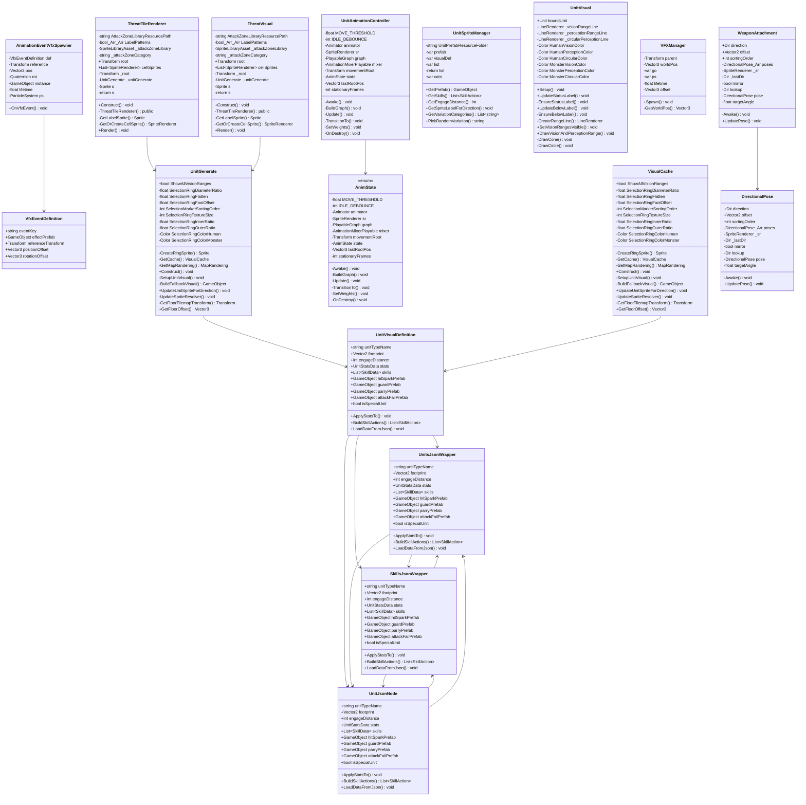

# Package `Unit/Visual` UML Class Diagram

**소스 경로:** `Assets/Unit/Visual`

### 📋 스크립트 클래스 명세

#### `AnimationEventVfxSpawner` (class)
- **경로:** `Script/Unit/Visual/AnimationEventVfxSpawner.cs`
- **상속/인터페이스:** `MonoBehaviour`
- **변수/프로퍼티:**
  - `-VfxEventDefinition def`
  - `-Transform reference`
  - `-Vector3 pos`
  - `-Quaternion rot`
  - `-GameObject instance`
  - `-float lifetime`
  - `-ParticleSystem ps`
- **함수:**
  - `+OnVfxEvent() void`

#### `ThreatTileRenderer` (class)
- **경로:** `Script/Unit/Visual/ThreatTileRenderer.cs`
- **변수/프로퍼티:**
  - `-string AttackZoneLibraryResourcePath`
  - `-bool_Arr_Arr LabelPatterns`
  - `-SpriteLibraryAsset _attackZoneLibrary`
  - `-string _attackZoneCategory`
  - `+Transform root`
  - `+List~SpriteRenderer~ cellSprites`
  - `-Transform _root`
  - `-UnitGenerate _unitGenerate`
  - `-Sprite s`
  - `-return s`
  - `-bool_Arr p`
  - `-bool r0`
  - `-bool r1`
  - `-bool r2`
  - `-bool r3`
- **함수:**
  - `+Construct() void`
  - `-ThreatTileRenderer() public`
  - `-GetLabelSprite() Sprite`
  - `-GetOrCreateCellSprite() SpriteRenderer`
  - `+Render() void`

#### `ThreatVisual` (class)
- **경로:** `Script/Unit/Visual/ThreatTileRenderer.cs`
- **변수/프로퍼티:**
  - `-string AttackZoneLibraryResourcePath`
  - `-bool_Arr_Arr LabelPatterns`
  - `-SpriteLibraryAsset _attackZoneLibrary`
  - `-string _attackZoneCategory`
  - `+Transform root`
  - `+List~SpriteRenderer~ cellSprites`
  - `-Transform _root`
  - `-UnitGenerate _unitGenerate`
  - `-Sprite s`
  - `-return s`
  - `-bool_Arr p`
  - `-bool r0`
  - `-bool r1`
  - `-bool r2`
  - `-bool r3`
- **함수:**
  - `+Construct() void`
  - `-ThreatTileRenderer() public`
  - `-GetLabelSprite() Sprite`
  - `-GetOrCreateCellSprite() SpriteRenderer`
  - `+Render() void`

#### `UnitAnimationController` (class)
- **경로:** `Script/Unit/Visual/UnitAnimationController.cs`
- **상속/인터페이스:** `MonoBehaviour`
- **변수/프로퍼티:**
  - `-float MOVE_THRESHOLD`
  - `-int IDLE_DEBOUNCE`
  - `-Animator animator`
  - `-SpriteRenderer sr`
  - `-PlayableGraph graph`
  - `-AnimationMixerPlayable mixer`
  - `-Transform movementRoot`
  - `-AnimState state`
  - `-Vector3 lastRootPos`
  - `-int stationaryFrames`
  - `-var output`
  - `-Vector3 delta`
  - `-bool moving`
- **함수:**
  - `-Awake() void`
  - `-BuildGraph() void`
  - `-Update() void`
  - `-TransitionTo() void`
  - `-SetWeights() void`
  - `-OnDestroy() void`

#### `AnimState` (enum)
- **경로:** `Script/Unit/Visual/UnitAnimationController.cs`
- **변수/프로퍼티:**
  - `-float MOVE_THRESHOLD`
  - `-int IDLE_DEBOUNCE`
  - `-Animator animator`
  - `-SpriteRenderer sr`
  - `-PlayableGraph graph`
  - `-AnimationMixerPlayable mixer`
  - `-Transform movementRoot`
  - `-AnimState state`
  - `-Vector3 lastRootPos`
  - `-int stationaryFrames`
  - `-var output`
  - `-Vector3 delta`
  - `-bool moving`
- **함수:**
  - `-Awake() void`
  - `-BuildGraph() void`
  - `-Update() void`
  - `-TransitionTo() void`
  - `-SetWeights() void`
  - `-OnDestroy() void`

#### `UnitGenerate` (class)
- **경로:** `Script/Unit/Visual/UnitGenerate.cs`
- **변수/프로퍼티:**
  - `+bool ShowAllVisionRanges`
  - `-float SelectionRingDiameterRatio`
  - `-float SelectionRingFlatten`
  - `-float SelectionRingFootOffset`
  - `-int SelectionMarkerSortingOrder`
  - `-int SelectionRingTextureSize`
  - `-float SelectionRingInnerRatio`
  - `-float SelectionRingOuterRatio`
  - `-Color SelectionRingColorHuman`
  - `-Color SelectionRingColorMonster`
  - `-Sprite _selectionRingSprite`
  - `-return _selectionRingSprite`
  - `-Texture2D tex`
  - `-Color_Arr pixels`
  - `-Vector2 center`
- **함수:**
  - `-CreateRingSprite() Sprite`
  - `-GetCache() VisualCache`
  - `-GetMapRandering() MapRandering`
  - `+Construct() void`
  - `-SetupUnitVisual() void`
  - `-BuildFallbackVisual() GameObject`
  - `+UpdateUnitSpriteForDirection() void`
  - `-UpdateSpriteResolver() void`
  - `-GetFloorTilemapTransform() Transform`
  - `+GetFloorOffset() Vector3`
  - `+RemoveVisual() void`
  - `-KillVisualTweens() void`
  - `+SyncVisuals() void`
  - `-EnsureSelectionMarker() void`
  - `+TriggerHitEffect() void`

#### `VisualCache` (class)
- **경로:** `Script/Unit/Visual/UnitGenerate.cs`
- **변수/프로퍼티:**
  - `+bool ShowAllVisionRanges`
  - `-float SelectionRingDiameterRatio`
  - `-float SelectionRingFlatten`
  - `-float SelectionRingFootOffset`
  - `-int SelectionMarkerSortingOrder`
  - `-int SelectionRingTextureSize`
  - `-float SelectionRingInnerRatio`
  - `-float SelectionRingOuterRatio`
  - `-Color SelectionRingColorHuman`
  - `-Color SelectionRingColorMonster`
  - `-Sprite _selectionRingSprite`
  - `-return _selectionRingSprite`
  - `-Texture2D tex`
  - `-Color_Arr pixels`
  - `-Vector2 center`
- **함수:**
  - `-CreateRingSprite() Sprite`
  - `-GetCache() VisualCache`
  - `-GetMapRandering() MapRandering`
  - `+Construct() void`
  - `-SetupUnitVisual() void`
  - `-BuildFallbackVisual() GameObject`
  - `+UpdateUnitSpriteForDirection() void`
  - `-UpdateSpriteResolver() void`
  - `-GetFloorTilemapTransform() Transform`
  - `+GetFloorOffset() Vector3`
  - `+RemoveVisual() void`
  - `-KillVisualTweens() void`
  - `+SyncVisuals() void`
  - `-EnsureSelectionMarker() void`
  - `+TriggerHitEffect() void`

#### `UnitSpriteManager` (class)
- **경로:** `Script/Unit/Visual/UnitSpriteManager.cs`
- **변수/프로퍼티:**
  - `-string UnitPrefabResourceFolder`
  - `-var prefab`
  - `-var visualDef`
  - `-var list`
  - `-return list`
  - `-var prefab`
  - `-var visualDef`
  - `-var cats`
- **함수:**
  - `+GetPrefab() GameObject`
  - `+GetSkills() List~SkillAction~`
  - `+GetEngageDistance() int`
  - `+GetSpriteLabelForDirection() void`
  - `+GetVariationCategories() List~string~`
  - `+PickRandomVariation() string`

#### `UnitVisual` (class)
- **경로:** `Script/Unit/Visual/UnitVisual.cs`
- **상속/인터페이스:** `MonoBehaviour`
- **변수/프로퍼티:**
  - `+Unit boundUnit`
  - `-LineRenderer _visionRangeLine`
  - `-LineRenderer _perceptionRangeLine`
  - `-LineRenderer _circularPerceptionLine`
  - `-Color HumanVisionColor`
  - `-Color HumanPerceptionColor`
  - `-Color HumanCircularColor`
  - `-Color MonsterVisionColor`
  - `-Color MonsterPerceptionColor`
  - `-Color MonsterCircularColor`
  - `-float VisionLineWidth`
  - `-float PerceptionLineWidth`
  - `-float CircularLineWidth`
  - `-Color visionColor`
  - `-Color perceptionColor`
- **함수:**
  - `+Setup() void`
  - `+UpdateStatusLabel() void`
  - `-EnsureStatusLabel() void`
  - `+UpdateBelowLabel() void`
  - `-EnsureBelowLabel() void`
  - `-CreateRangeLine() LineRenderer`
  - `+SetVisionRangesVisible() void`
  - `+DrawVisionAndPerceptionRange() void`
  - `-DrawCone() void`
  - `-DrawCircle() void`

#### `UnitVisualDefinition` (class)
- **경로:** `Script/Unit/Visual/UnitVisualDefinition.cs`
- **상속/인터페이스:** `MonoBehaviour`
- **변수/프로퍼티:**
  - `+string unitTypeName`
  - `+Vector2 footprint`
  - `+int engageDistance`
  - `+UnitStatsData stats`
  - `+List~SkillData~ skills`
  - `+GameObject hitSparkPrefab`
  - `+GameObject guardPrefab`
  - `+GameObject parryPrefab`
  - `+GameObject attackFailPrefab`
  - `+bool isSpecialUnit`
  - `+bool isInterestTarget`
  - `+float baseInterest`
  - `+float baseDanger`
  - `+float heavyHitThreshold`
  - `+float stealth`
- **함수:**
  - `+ApplyStatsTo() void`
  - `+BuildSkillActions() List~SkillAction~`
  - `+LoadDataFromJson() void`

#### `UnitsJsonWrapper` (class)
- **경로:** `Script/Unit/Visual/UnitVisualDefinition.cs`
- **변수/프로퍼티:**
  - `+string unitTypeName`
  - `+Vector2 footprint`
  - `+int engageDistance`
  - `+UnitStatsData stats`
  - `+List~SkillData~ skills`
  - `+GameObject hitSparkPrefab`
  - `+GameObject guardPrefab`
  - `+GameObject parryPrefab`
  - `+GameObject attackFailPrefab`
  - `+bool isSpecialUnit`
  - `+bool isInterestTarget`
  - `+float baseInterest`
  - `+float baseDanger`
  - `+float heavyHitThreshold`
  - `+float stealth`
- **함수:**
  - `+ApplyStatsTo() void`
  - `+BuildSkillActions() List~SkillAction~`
  - `+LoadDataFromJson() void`

#### `UnitJsonNode` (class)
- **경로:** `Script/Unit/Visual/UnitVisualDefinition.cs`
- **변수/프로퍼티:**
  - `+string unitTypeName`
  - `+Vector2 footprint`
  - `+int engageDistance`
  - `+UnitStatsData stats`
  - `+List~SkillData~ skills`
  - `+GameObject hitSparkPrefab`
  - `+GameObject guardPrefab`
  - `+GameObject parryPrefab`
  - `+GameObject attackFailPrefab`
  - `+bool isSpecialUnit`
  - `+bool isInterestTarget`
  - `+float baseInterest`
  - `+float baseDanger`
  - `+float heavyHitThreshold`
  - `+float stealth`
- **함수:**
  - `+ApplyStatsTo() void`
  - `+BuildSkillActions() List~SkillAction~`
  - `+LoadDataFromJson() void`

#### `SkillsJsonWrapper` (class)
- **경로:** `Script/Unit/Visual/UnitVisualDefinition.cs`
- **변수/프로퍼티:**
  - `+string unitTypeName`
  - `+Vector2 footprint`
  - `+int engageDistance`
  - `+UnitStatsData stats`
  - `+List~SkillData~ skills`
  - `+GameObject hitSparkPrefab`
  - `+GameObject guardPrefab`
  - `+GameObject parryPrefab`
  - `+GameObject attackFailPrefab`
  - `+bool isSpecialUnit`
  - `+bool isInterestTarget`
  - `+float baseInterest`
  - `+float baseDanger`
  - `+float heavyHitThreshold`
  - `+float stealth`
- **함수:**
  - `+ApplyStatsTo() void`
  - `+BuildSkillActions() List~SkillAction~`
  - `+LoadDataFromJson() void`

#### `VfxEventDefinition` (class)
- **경로:** `Script/Unit/Visual/VfxEventDefinition.cs`
- **변수/프로퍼티:**
  - `+string eventKey`
  - `+GameObject effectPrefab`
  - `+Transform referenceTransform`
  - `+Vector3 positionOffset`
  - `+Vector3 rotationOffset`

#### `VFXManager` (class)
- **경로:** `Script/Unit/Visual/VFXManager.cs`
- **변수/프로퍼티:**
  - `-Transform parent`
  - `-Vector3 worldPos`
  - `-var go`
  - `-var ps`
  - `-float lifetime`
  - `-Vector3 offset`
- **함수:**
  - `+Spawn() void`
  - `-GetWorldPos() Vector3`

#### `WeaponAttachment` (class)
- **경로:** `Script/Unit/Visual/WeaponAttachment.cs`
- **상속/인터페이스:** `MonoBehaviour`
- **변수/프로퍼티:**
  - `+Dir direction`
  - `+Vector2 offset`
  - `+int sortingOrder`
  - `-DirectionalPose_Arr poses`
  - `-SpriteRenderer _sr`
  - `-Dir _lastDir`
  - `-bool mirror`
  - `-Dir lookup`
  - `-DirectionalPose pose`
  - `-float targetAngle`
  - `-float nativeAngle`
- **함수:**
  - `-Awake() void`
  - `+UpdatePose() void`

#### `DirectionalPose` (class)
- **경로:** `Script/Unit/Visual/WeaponAttachment.cs`
- **변수/프로퍼티:**
  - `+Dir direction`
  - `+Vector2 offset`
  - `+int sortingOrder`
  - `-DirectionalPose_Arr poses`
  - `-SpriteRenderer _sr`
  - `-Dir _lastDir`
  - `-bool mirror`
  - `-Dir lookup`
  - `-DirectionalPose pose`
  - `-float targetAngle`
  - `-float nativeAngle`
- **함수:**
  - `-Awake() void`
  - `+UpdatePose() void`

