# Package `Unit/Weight` UML Class Diagram

**소스 경로:** `Assets/Unit/Weight`

```mermaid
classDiagram
    class HumanKnowledgeBase {
        -List~IncidentEntry~ _pendingIncidents
        -return s
        -string targetId
        -bool isIndividualTarget
        -MentalErrorState mentalState
        -string key
        -float ratio
        -var survivorNames
        -var survivorEntries
        -var groups
        -GetOrCreateSpecies() SpeciesWeightState
        -GetOrCreateIndividual() IndividualWeightState
        +RecordEvent() void
        -RecordEventForWeight() void
        +GetMentalState() MentalErrorState
        +InitializeNewUnitPersonalInfo() void
        -SetPersonalInitial() void
        +OnWaveEnd() void
        -ApplyUnderstandingGlobal() void
        -ApplyRawUnderstanding() void
    }
    HumanKnowledgeBase --> DangerStage
    HumanKnowledgeBase --> MentalErrorState
    HumanKnowledgeBase --> IncidentEntry
    class WipeoutTraceRecord {
        -List~IncidentEntry~ _pendingIncidents
        -return s
        -string targetId
        -bool isIndividualTarget
        -MentalErrorState mentalState
        -string key
        -float ratio
        -var survivorNames
        -var survivorEntries
        -var groups
        -GetOrCreateSpecies() SpeciesWeightState
        -GetOrCreateIndividual() IndividualWeightState
        +RecordEvent() void
        -RecordEventForWeight() void
        +GetMentalState() MentalErrorState
        +InitializeNewUnitPersonalInfo() void
        -SetPersonalInitial() void
        +OnWaveEnd() void
        -ApplyUnderstandingGlobal() void
        -ApplyRawUnderstanding() void
    }
    WipeoutTraceRecord --> DangerStage
    WipeoutTraceRecord --> MentalErrorState
    WipeoutTraceRecord --> IncidentEntry
    class IncidentEntry {
        +string IncidentId
        +EventId EventId
        +string TargetId
        +WeightType WeightType
        +InfoType InfoType
        +float ChangeValue
        +MentalErrorState MentalStateAtRecord
        +string ObserverUnitName
        +bool IsIndividualTarget
        +string DedupKey
        -IncidentEntry() public
    }
    IncidentEntry --> EventId
    IncidentEntry --> WeightType
    IncidentEntry --> InfoType
    IncidentEntry --> MentalErrorState
    class PersonalMapKnowledge {
        +IEnumerable~Vector3Int~ KnownInterestTiles
        -string objId
        -bool newInterestPresent
        -float elapsed
        -var stage
        -float baseTileDanger
        -float objectDanger
        +IEnumerable~Vector3Int~ KnownDangerTiles
        -HashSet~int~ _dirtyTerrainFloors
        -bool isFirstReveal
        +TickTileInterestConfirm() void
        +GetTileDanger() float
        +SetTileDangerFromUnit() void
        +TickTileSafety() void
        +RevealTile() bool
        +GetTerrainTexture() Texture2D
        +RegisterObject() void
        +GetTileInterest() float
        -GetUnitInterestAtTile() float
        +OnObjectInvestigated() void
    }
    PersonalMapKnowledge --> RoomExploreState
    PersonalMapKnowledge --> InfoType
    class MonsterSighting {
        +IEnumerable~Vector3Int~ KnownInterestTiles
        -string objId
        -bool newInterestPresent
        -float elapsed
        -var stage
        -float baseTileDanger
        -float objectDanger
        +IEnumerable~Vector3Int~ KnownDangerTiles
        -HashSet~int~ _dirtyTerrainFloors
        -bool isFirstReveal
        +TickTileInterestConfirm() void
        +GetTileDanger() float
        +SetTileDangerFromUnit() void
        +TickTileSafety() void
        +RevealTile() bool
        +GetTerrainTexture() Texture2D
        +RegisterObject() void
        +GetTileInterest() float
        -GetUnitInterestAtTile() float
        +OnObjectInvestigated() void
    }
    MonsterSighting --> RoomExploreState
    MonsterSighting --> InfoType
    class RoomExploreState {
        <<enum>>
        +IEnumerable~Vector3Int~ KnownInterestTiles
        -string objId
        -bool newInterestPresent
        -float elapsed
        -var stage
        -float baseTileDanger
        -float objectDanger
        +IEnumerable~Vector3Int~ KnownDangerTiles
        -HashSet~int~ _dirtyTerrainFloors
        -bool isFirstReveal
        +TickTileInterestConfirm() void
        +GetTileDanger() float
        +SetTileDangerFromUnit() void
        +TickTileSafety() void
        +RevealTile() bool
        +GetTerrainTexture() Texture2D
        +RegisterObject() void
        +GetTileInterest() float
        -GetUnitInterestAtTile() float
        +OnObjectInvestigated() void
    }
    RoomExploreState --> InfoType
    class RoomKnowledge {
        +IEnumerable~Vector3Int~ KnownInterestTiles
        -string objId
        -bool newInterestPresent
        -float elapsed
        -var stage
        -float baseTileDanger
        -float objectDanger
        +IEnumerable~Vector3Int~ KnownDangerTiles
        -HashSet~int~ _dirtyTerrainFloors
        -bool isFirstReveal
        +TickTileInterestConfirm() void
        +GetTileDanger() float
        +SetTileDangerFromUnit() void
        +TickTileSafety() void
        +RevealTile() bool
        +GetTerrainTexture() Texture2D
        +RegisterObject() void
        +GetTileInterest() float
        -GetUnitInterestAtTile() float
        +OnObjectInvestigated() void
    }
    RoomKnowledge --> RoomExploreState
    RoomKnowledge --> InfoType
    class PersonalWeightRecord {
        +string TargetId
        +WeightType Type
        +float StoredValue
        +int AppliedValue
        +InfoType LastInfoType
        +MentalErrorState MentalStateAtRecord
        -PersonalWeightRecord() public
    }
    PersonalWeightRecord --> WeightType
    PersonalWeightRecord --> InfoType
    PersonalWeightRecord --> MentalErrorState
    class SpeciesWeightState {
        +string SpeciesKey
        +float UnderstandingStored
        +int LastUnderstandingUpdateWave
        +float DangerAccumulatedStored
        +float SpecialActionCap
        +float SummonAccum
        +float BuffAccum
        +float DebuffAccum
        +string UnitId
        -SpeciesWeightState() public
        -IndividualWeightState() public
    }
    class IndividualWeightState {
        +string SpeciesKey
        +float UnderstandingStored
        +int LastUnderstandingUpdateWave
        +float DangerAccumulatedStored
        +float SpecialActionCap
        +float SummonAccum
        +float BuffAccum
        +float DebuffAccum
        +string UnitId
        -SpeciesWeightState() public
        -IndividualWeightState() public
    }
    class WeightType {
        <<enum>>
    }
    class InfoType {
        <<enum>>
    }
    class MentalErrorState {
        <<enum>>
    }
    class DangerStage {
        <<enum>>
    }
    class InterestStage {
        <<enum>>
    }
    class EventId {
        <<enum>>
    }
    class WeightEventTable {
        -string JsonPath
        +float Understanding
        +float Danger
        +string id
        +float understanding
        +float danger
        -return _table
        -var db
        -return default
        -Delta() public
        -Load() void
        +Get() Delta
    }
    class Delta {
        <<struct>>
        -string JsonPath
        +float Understanding
        +float Danger
        +string id
        +float understanding
        +float danger
        -return _table
        -var db
        -return default
        -Delta() public
        -Load() void
        +Get() Delta
    }
    class JsonEvent {
        -string JsonPath
        +float Understanding
        +float Danger
        +string id
        +float understanding
        +float danger
        -return _table
        -var db
        -return default
        -Delta() public
        -Load() void
        +Get() Delta
    }
    class JsonEventDatabase {
        -string JsonPath
        +float Understanding
        +float Danger
        +string id
        +float understanding
        +float danger
        -return _table
        -var db
        -return default
        -Delta() public
        -Load() void
        +Get() Delta
    }
    class WeightMath {
        +float UnderstandingMin
        +float DangerMin
        +float InterestMin
        -var distinct
        -float sum
        -var result
        -return result
        -var seen
        +float PanicWeight
        -var panic
        +Clamp() float
        +DedupExact() List~IncidentEntry~
        -ResolvePanicBlend() List~float~
        -RepresentativeChange() float
        +ComputeGlobalReflectionAmount() float
        +ComposeUnderstanding() float
        -Clamp() return
        -PoolOverflowResult() public
        +ComputePoolDecrease() PoolOverflowResult
        +HiddenInfoNoiseRatio() float
    }
    class PoolOverflowResult {
        <<struct>>
        +float UnderstandingMin
        +float DangerMin
        +float InterestMin
        -var distinct
        -float sum
        -var result
        -return result
        -var seen
        +float PanicWeight
        -var panic
        +Clamp() float
        +DedupExact() List~IncidentEntry~
        -ResolvePanicBlend() List~float~
        -RepresentativeChange() float
        +ComputeGlobalReflectionAmount() float
        +ComposeUnderstanding() float
        -Clamp() return
        -PoolOverflowResult() public
        +ComputePoolDecrease() PoolOverflowResult
        +HiddenInfoNoiseRatio() float
    }
```

### 📋 스크립트 클래스 명세

#### `HumanKnowledgeBase` (class)
- **경로:** `Script/Unit/Weight/HumanKnowledgeBase.cs`
- **변수/프로퍼티:**
  - `-List~IncidentEntry~ _pendingIncidents`
  - `-return s`
  - `-return s`
  - `-string targetId`
  - `-bool isIndividualTarget`
  - `-MentalErrorState mentalState`
  - `-string key`
  - `-float ratio`
  - `-string key`
  - `-var survivorNames`
  - `-var survivorEntries`
  - `-var groups`
  - `-float amount`
  - `-string targetId`
  - `-bool isIndividual`
- **함수:**
  - `-GetOrCreateSpecies() SpeciesWeightState`
  - `-GetOrCreateIndividual() IndividualWeightState`
  - `+RecordEvent() void`
  - `-RecordEventForWeight() void`
  - `+GetMentalState() MentalErrorState`
  - `+InitializeNewUnitPersonalInfo() void`
  - `-SetPersonalInitial() void`
  - `+OnWaveEnd() void`
  - `-ApplyUnderstandingGlobal() void`
  - `-ApplyRawUnderstanding() void`
  - `+GetUnderstanding() float`
  - `-ApplyDangerGlobal() void`
  - `+ApplyTotalDamageDangerDecreaseCheck() void`
  - `+ApplyPerHitDangerDecreaseCheck() void`
  - `+GetFinalDanger() float`

#### `WipeoutTraceRecord` (class)
- **경로:** `Script/Unit/Weight/HumanKnowledgeBase.cs`
- **변수/프로퍼티:**
  - `-List~IncidentEntry~ _pendingIncidents`
  - `-return s`
  - `-return s`
  - `-string targetId`
  - `-bool isIndividualTarget`
  - `-MentalErrorState mentalState`
  - `-string key`
  - `-float ratio`
  - `-string key`
  - `-var survivorNames`
  - `-var survivorEntries`
  - `-var groups`
  - `-float amount`
  - `-string targetId`
  - `-bool isIndividual`
- **함수:**
  - `-GetOrCreateSpecies() SpeciesWeightState`
  - `-GetOrCreateIndividual() IndividualWeightState`
  - `+RecordEvent() void`
  - `-RecordEventForWeight() void`
  - `+GetMentalState() MentalErrorState`
  - `+InitializeNewUnitPersonalInfo() void`
  - `-SetPersonalInitial() void`
  - `+OnWaveEnd() void`
  - `-ApplyUnderstandingGlobal() void`
  - `-ApplyRawUnderstanding() void`
  - `+GetUnderstanding() float`
  - `-ApplyDangerGlobal() void`
  - `+ApplyTotalDamageDangerDecreaseCheck() void`
  - `+ApplyPerHitDangerDecreaseCheck() void`
  - `+GetFinalDanger() float`

#### `IncidentEntry` (class)
- **경로:** `Script/Unit/Weight/IncidentLog.cs`
- **변수/프로퍼티:**
  - `+string IncidentId`
  - `+EventId EventId`
  - `+string TargetId`
  - `+WeightType WeightType`
  - `+InfoType InfoType`
  - `+float ChangeValue`
  - `+MentalErrorState MentalStateAtRecord`
  - `+string ObserverUnitName`
  - `+bool IsIndividualTarget`
  - `+string DedupKey`
- **함수:**
  - `-IncidentEntry() public`

#### `PersonalMapKnowledge` (class)
- **경로:** `Script/Unit/Weight/PersonalMapKnowledge.cs`
- **변수/프로퍼티:**
  - `+IEnumerable~Vector3Int~ KnownInterestTiles`
  - `-string objId`
  - `-bool newInterestPresent`
  - `-float elapsed`
  - `-var stage`
  - `-float baseTileDanger`
  - `-string objId`
  - `-float objectDanger`
  - `+IEnumerable~Vector3Int~ KnownDangerTiles`
  - `-float elapsed`
  - `-var stage`
  - `-HashSet~int~ _dirtyTerrainFloors`
  - `-bool isFirstReveal`
  - `-return isFirstReveal`
  - `+IEnumerable~int~ KnownTerrainFloors`
- **함수:**
  - `+TickTileInterestConfirm() void`
  - `+GetTileDanger() float`
  - `+SetTileDangerFromUnit() void`
  - `+TickTileSafety() void`
  - `+RevealTile() bool`
  - `+GetTerrainTexture() Texture2D`
  - `+RegisterObject() void`
  - `+GetTileInterest() float`
  - `-GetUnitInterestAtTile() float`
  - `+OnObjectInvestigated() void`
  - `+OnObjectCollected() void`
  - `+OnObjectDestroyed() void`
  - `-ClearObjectFromRooms() void`
  - `+OnObjectDroppedByCarrierDeath() void`
  - `+RecordTrapAttempt() void`

#### `MonsterSighting` (class)
- **경로:** `Script/Unit/Weight/PersonalMapKnowledge.cs`
- **변수/프로퍼티:**
  - `+IEnumerable~Vector3Int~ KnownInterestTiles`
  - `-string objId`
  - `-bool newInterestPresent`
  - `-float elapsed`
  - `-var stage`
  - `-float baseTileDanger`
  - `-string objId`
  - `-float objectDanger`
  - `+IEnumerable~Vector3Int~ KnownDangerTiles`
  - `-float elapsed`
  - `-var stage`
  - `-HashSet~int~ _dirtyTerrainFloors`
  - `-bool isFirstReveal`
  - `-return isFirstReveal`
  - `+IEnumerable~int~ KnownTerrainFloors`
- **함수:**
  - `+TickTileInterestConfirm() void`
  - `+GetTileDanger() float`
  - `+SetTileDangerFromUnit() void`
  - `+TickTileSafety() void`
  - `+RevealTile() bool`
  - `+GetTerrainTexture() Texture2D`
  - `+RegisterObject() void`
  - `+GetTileInterest() float`
  - `-GetUnitInterestAtTile() float`
  - `+OnObjectInvestigated() void`
  - `+OnObjectCollected() void`
  - `+OnObjectDestroyed() void`
  - `-ClearObjectFromRooms() void`
  - `+OnObjectDroppedByCarrierDeath() void`
  - `+RecordTrapAttempt() void`

#### `RoomExploreState` (enum)
- **경로:** `Script/Unit/Weight/PersonalMapKnowledge.cs`
- **변수/프로퍼티:**
  - `+IEnumerable~Vector3Int~ KnownInterestTiles`
  - `-string objId`
  - `-bool newInterestPresent`
  - `-float elapsed`
  - `-var stage`
  - `-float baseTileDanger`
  - `-string objId`
  - `-float objectDanger`
  - `+IEnumerable~Vector3Int~ KnownDangerTiles`
  - `-float elapsed`
  - `-var stage`
  - `-HashSet~int~ _dirtyTerrainFloors`
  - `-bool isFirstReveal`
  - `-return isFirstReveal`
  - `+IEnumerable~int~ KnownTerrainFloors`
- **함수:**
  - `+TickTileInterestConfirm() void`
  - `+GetTileDanger() float`
  - `+SetTileDangerFromUnit() void`
  - `+TickTileSafety() void`
  - `+RevealTile() bool`
  - `+GetTerrainTexture() Texture2D`
  - `+RegisterObject() void`
  - `+GetTileInterest() float`
  - `-GetUnitInterestAtTile() float`
  - `+OnObjectInvestigated() void`
  - `+OnObjectCollected() void`
  - `+OnObjectDestroyed() void`
  - `-ClearObjectFromRooms() void`
  - `+OnObjectDroppedByCarrierDeath() void`
  - `+RecordTrapAttempt() void`

#### `RoomKnowledge` (class)
- **경로:** `Script/Unit/Weight/PersonalMapKnowledge.cs`
- **변수/프로퍼티:**
  - `+IEnumerable~Vector3Int~ KnownInterestTiles`
  - `-string objId`
  - `-bool newInterestPresent`
  - `-float elapsed`
  - `-var stage`
  - `-float baseTileDanger`
  - `-string objId`
  - `-float objectDanger`
  - `+IEnumerable~Vector3Int~ KnownDangerTiles`
  - `-float elapsed`
  - `-var stage`
  - `-HashSet~int~ _dirtyTerrainFloors`
  - `-bool isFirstReveal`
  - `-return isFirstReveal`
  - `+IEnumerable~int~ KnownTerrainFloors`
- **함수:**
  - `+TickTileInterestConfirm() void`
  - `+GetTileDanger() float`
  - `+SetTileDangerFromUnit() void`
  - `+TickTileSafety() void`
  - `+RevealTile() bool`
  - `+GetTerrainTexture() Texture2D`
  - `+RegisterObject() void`
  - `+GetTileInterest() float`
  - `-GetUnitInterestAtTile() float`
  - `+OnObjectInvestigated() void`
  - `+OnObjectCollected() void`
  - `+OnObjectDestroyed() void`
  - `-ClearObjectFromRooms() void`
  - `+OnObjectDroppedByCarrierDeath() void`
  - `+RecordTrapAttempt() void`

#### `PersonalWeightRecord` (class)
- **경로:** `Script/Unit/Weight/PersonalWeightRecord.cs`
- **변수/프로퍼티:**
  - `+string TargetId`
  - `+WeightType Type`
  - `+float StoredValue`
  - `+int AppliedValue`
  - `+InfoType LastInfoType`
  - `+MentalErrorState MentalStateAtRecord`
- **함수:**
  - `-PersonalWeightRecord() public`

#### `SpeciesWeightState` (class)
- **경로:** `Script/Unit/Weight/SpeciesWeightState.cs`
- **변수/프로퍼티:**
  - `+string SpeciesKey`
  - `+float UnderstandingStored`
  - `+int LastUnderstandingUpdateWave`
  - `+float DangerAccumulatedStored`
  - `+float SpecialActionCap`
  - `+float SummonAccum`
  - `+float BuffAccum`
  - `+float DebuffAccum`
  - `+string UnitId`
  - `+float UnderstandingStored`
  - `+int LastUnderstandingUpdateWave`
  - `+float DangerAccumulatedStored`
- **함수:**
  - `-SpeciesWeightState() public`
  - `-IndividualWeightState() public`

#### `IndividualWeightState` (class)
- **경로:** `Script/Unit/Weight/SpeciesWeightState.cs`
- **변수/프로퍼티:**
  - `+string SpeciesKey`
  - `+float UnderstandingStored`
  - `+int LastUnderstandingUpdateWave`
  - `+float DangerAccumulatedStored`
  - `+float SpecialActionCap`
  - `+float SummonAccum`
  - `+float BuffAccum`
  - `+float DebuffAccum`
  - `+string UnitId`
  - `+float UnderstandingStored`
  - `+int LastUnderstandingUpdateWave`
  - `+float DangerAccumulatedStored`
- **함수:**
  - `-SpeciesWeightState() public`
  - `-IndividualWeightState() public`

#### `WeightType` (enum)
- **경로:** `Script/Unit/Weight/WeightEnums.cs`

#### `InfoType` (enum)
- **경로:** `Script/Unit/Weight/WeightEnums.cs`

#### `MentalErrorState` (enum)
- **경로:** `Script/Unit/Weight/WeightEnums.cs`

#### `DangerStage` (enum)
- **경로:** `Script/Unit/Weight/WeightEnums.cs`

#### `InterestStage` (enum)
- **경로:** `Script/Unit/Weight/WeightEnums.cs`

#### `EventId` (enum)
- **경로:** `Script/Unit/Weight/WeightEnums.cs`

#### `WeightEventTable` (class)
- **경로:** `Script/Unit/Weight/WeightEventTable.cs`
- **변수/프로퍼티:**
  - `-string JsonPath`
  - `+float Understanding`
  - `+float Danger`
  - `+string id`
  - `+float understanding`
  - `+float danger`
  - `-return _table`
  - `-var db`
  - `-return default`
- **함수:**
  - `-Delta() public`
  - `-Load() void`
  - `+Get() Delta`

#### `Delta` (struct)
- **경로:** `Script/Unit/Weight/WeightEventTable.cs`
- **변수/프로퍼티:**
  - `-string JsonPath`
  - `+float Understanding`
  - `+float Danger`
  - `+string id`
  - `+float understanding`
  - `+float danger`
  - `-return _table`
  - `-var db`
  - `-return default`
- **함수:**
  - `-Delta() public`
  - `-Load() void`
  - `+Get() Delta`

#### `JsonEvent` (class)
- **경로:** `Script/Unit/Weight/WeightEventTable.cs`
- **변수/프로퍼티:**
  - `-string JsonPath`
  - `+float Understanding`
  - `+float Danger`
  - `+string id`
  - `+float understanding`
  - `+float danger`
  - `-return _table`
  - `-var db`
  - `-return default`
- **함수:**
  - `-Delta() public`
  - `-Load() void`
  - `+Get() Delta`

#### `JsonEventDatabase` (class)
- **경로:** `Script/Unit/Weight/WeightEventTable.cs`
- **변수/프로퍼티:**
  - `-string JsonPath`
  - `+float Understanding`
  - `+float Danger`
  - `+string id`
  - `+float understanding`
  - `+float danger`
  - `-return _table`
  - `-var db`
  - `-return default`
- **함수:**
  - `-Delta() public`
  - `-Load() void`
  - `+Get() Delta`

#### `WeightMath` (class)
- **경로:** `Script/Unit/Weight/WeightMath.cs`
- **변수/프로퍼티:**
  - `+float UnderstandingMin`
  - `+float DangerMin`
  - `+float InterestMin`
  - `-var distinct`
  - `-float sum`
  - `-var result`
  - `-return result`
  - `-var seen`
  - `-var result`
  - `-return result`
  - `+float PanicWeight`
  - `-var panic`
  - `-var nonPanic`
  - `-float panicAvg`
  - `-float nonPanicAvg`
- **함수:**
  - `+Clamp() float`
  - `+DedupExact() List~IncidentEntry~`
  - `-ResolvePanicBlend() List~float~`
  - `-RepresentativeChange() float`
  - `+ComputeGlobalReflectionAmount() float`
  - `+ComposeUnderstanding() float`
  - `-Clamp() return`
  - `-PoolOverflowResult() public`
  - `+ComputePoolDecrease() PoolOverflowResult`
  - `+HiddenInfoNoiseRatio() float`
  - `+ApplyHiddenInfoNoise() int`
  - `+TotalDamageDecreaseQualifies() bool`
  - `+PerHitDecreaseQualifies() bool`
  - `+ApplyDangerDecrease() float`
  - `+GetDangerStage() DangerStage`

#### `PoolOverflowResult` (struct)
- **경로:** `Script/Unit/Weight/WeightMath.cs`
- **변수/프로퍼티:**
  - `+float UnderstandingMin`
  - `+float DangerMin`
  - `+float InterestMin`
  - `-var distinct`
  - `-float sum`
  - `-var result`
  - `-return result`
  - `-var seen`
  - `-var result`
  - `-return result`
  - `+float PanicWeight`
  - `-var panic`
  - `-var nonPanic`
  - `-float panicAvg`
  - `-float nonPanicAvg`
- **함수:**
  - `+Clamp() float`
  - `+DedupExact() List~IncidentEntry~`
  - `-ResolvePanicBlend() List~float~`
  - `-RepresentativeChange() float`
  - `+ComputeGlobalReflectionAmount() float`
  - `+ComposeUnderstanding() float`
  - `-Clamp() return`
  - `-PoolOverflowResult() public`
  - `+ComputePoolDecrease() PoolOverflowResult`
  - `+HiddenInfoNoiseRatio() float`
  - `+ApplyHiddenInfoNoise() int`
  - `+TotalDamageDecreaseQualifies() bool`
  - `+PerHitDecreaseQualifies() bool`
  - `+ApplyDangerDecrease() float`
  - `+GetDangerStage() DangerStage`

