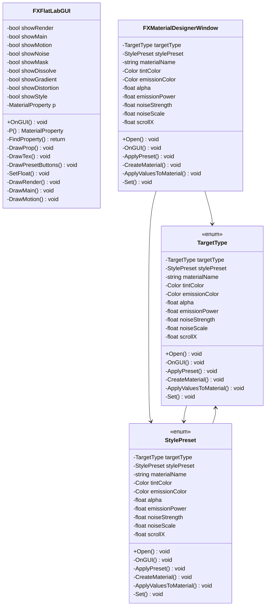

# Package `VFX/Shader/Editor` UML Class Diagram

**소스 경로:** `Assets/VFX/Shader/Editor`

### 📋 스크립트 클래스 명세

#### `FXFlatLabGUI` (class)
- **경로:** `VFX/Shader/Editor/FXAllInOneLabGUI.cs`
- **상속/인터페이스:** `ShaderGUI`
- **변수/프로퍼티:**
  - `-bool showRender`
  - `-bool showMain`
  - `-bool showMotion`
  - `-bool showNoise`
  - `-bool showMask`
  - `-bool showDissolve`
  - `-bool showGradient`
  - `-bool showDistortion`
  - `-bool showStyle`
  - `-MaterialProperty p`
  - `-MaterialProperty tex`
  - `-MaterialProperty color`
  - `-Material mat`
- **함수:**
  - `+OnGUI() void`
  - `-P() MaterialProperty`
  - `-FindProperty() return`
  - `-DrawProp() void`
  - `-DrawTex() void`
  - `-DrawPresetButtons() void`
  - `-SetFloat() void`
  - `-DrawRender() void`
  - `-DrawMain() void`
  - `-DrawMotion() void`
  - `-DrawNoise() void`
  - `-DrawMask() void`
  - `-DrawDissolve() void`
  - `-DrawGradient() void`
  - `-DrawDistortion() void`

#### `FXMaterialDesignerWindow` (class)
- **경로:** `VFX/Shader/Editor/FXMaterialDesignerWindow.cs`
- **상속/인터페이스:** `EditorWindow`
- **변수/프로퍼티:**
  - `-TargetType targetType`
  - `-StylePreset stylePreset`
  - `-string materialName`
  - `-Color tintColor`
  - `-Color emissionColor`
  - `-float alpha`
  - `-float emissionPower`
  - `-float noiseStrength`
  - `-float noiseScale`
  - `-float scrollX`
  - `-float scrollY`
  - `-float dissolveAmount`
  - `-float distortionStrength`
  - `-float softEdge`
  - `-bool useAdditive`
- **함수:**
  - `+Open() void`
  - `-OnGUI() void`
  - `-ApplyPreset() void`
  - `-CreateMaterial() void`
  - `-ApplyValuesToMaterial() void`
  - `-Set() void`
  - `-Set() void`

#### `TargetType` (enum)
- **경로:** `VFX/Shader/Editor/FXMaterialDesignerWindow.cs`
- **변수/프로퍼티:**
  - `-TargetType targetType`
  - `-StylePreset stylePreset`
  - `-string materialName`
  - `-Color tintColor`
  - `-Color emissionColor`
  - `-float alpha`
  - `-float emissionPower`
  - `-float noiseStrength`
  - `-float noiseScale`
  - `-float scrollX`
  - `-float scrollY`
  - `-float dissolveAmount`
  - `-float distortionStrength`
  - `-float softEdge`
  - `-bool useAdditive`
- **함수:**
  - `+Open() void`
  - `-OnGUI() void`
  - `-ApplyPreset() void`
  - `-CreateMaterial() void`
  - `-ApplyValuesToMaterial() void`
  - `-Set() void`
  - `-Set() void`

#### `StylePreset` (enum)
- **경로:** `VFX/Shader/Editor/FXMaterialDesignerWindow.cs`
- **변수/프로퍼티:**
  - `-TargetType targetType`
  - `-StylePreset stylePreset`
  - `-string materialName`
  - `-Color tintColor`
  - `-Color emissionColor`
  - `-float alpha`
  - `-float emissionPower`
  - `-float noiseStrength`
  - `-float noiseScale`
  - `-float scrollX`
  - `-float scrollY`
  - `-float dissolveAmount`
  - `-float distortionStrength`
  - `-float softEdge`
  - `-bool useAdditive`
- **함수:**
  - `+Open() void`
  - `-OnGUI() void`
  - `-ApplyPreset() void`
  - `-CreateMaterial() void`
  - `-ApplyValuesToMaterial() void`
  - `-Set() void`
  - `-Set() void`

