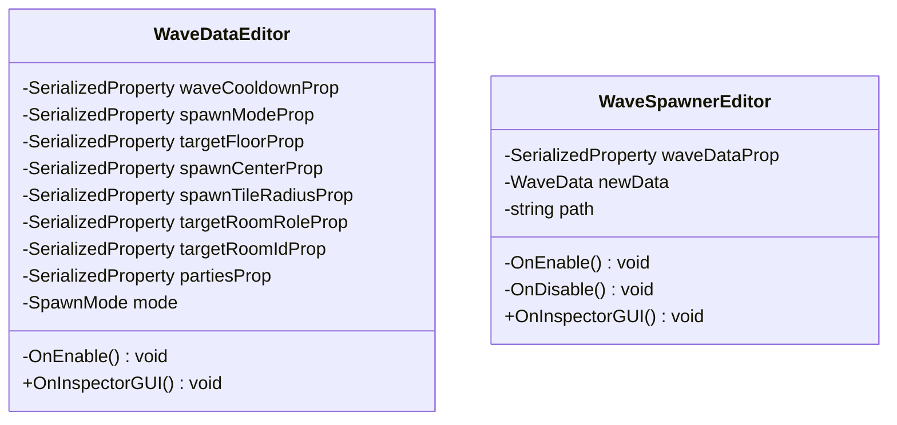

# Package `Wave/Editor` UML Class Diagram

**소스 경로:** `Assets/Wave/Editor`

### 📋 스크립트 클래스 명세

#### `WaveDataEditor` (class)
- **경로:** `Script/Wave/Editor/WaveDataEditor.cs`
- **상속/인터페이스:** `UnityEditor.Editor`
- **변수/프로퍼티:**
  - `-SerializedProperty waveCooldownProp`
  - `-SerializedProperty spawnModeProp`
  - `-SerializedProperty targetFloorProp`
  - `-SerializedProperty spawnCenterProp`
  - `-SerializedProperty spawnTileRadiusProp`
  - `-SerializedProperty targetRoomRoleProp`
  - `-SerializedProperty targetRoomIdProp`
  - `-SerializedProperty partiesProp`
  - `-SpawnMode mode`
- **함수:**
  - `-OnEnable() void`
  - `+OnInspectorGUI() void`

#### `WaveSpawnerEditor` (class)
- **경로:** `Script/Wave/Editor/WaveSpawnerEditor.cs`
- **상속/인터페이스:** `UnityEditor.Editor`
- **변수/프로퍼티:**
  - `-SerializedProperty waveDataProp`
  - `-WaveData newData`
  - `-string path`
- **함수:**
  - `-OnEnable() void`
  - `-OnDisable() void`
  - `+OnInspectorGUI() void`

