# Package `Wave` UML Class Diagram

**소스 경로:** `Assets/Wave`

```mermaid
classDiagram
    class WaveState {
        <<enum>>
        +float waveCooldown
        +WaveSpawner targetSpawner
        +WaveState currentState
        +float cooldownTimer
        +Party activeParty
        +InteractableObject dummyTarget
        +DummyTargetState targetState
        +Human targetCarrier
        +Vector2Int exitAreaPos
        -float PreSpawnLeadSeconds
        +Initialize() UniTask
        -WaveLoop() UniTaskVoid
        -PreSpawnWaveUnits() void
        -ResolveStairPositions() bool
        -FindSpawnPosNearFloor0Entrance() Vector2Int
        -UpdateStagingStairWalk() void
        -ForceCrossToTargetFloor() void
        -RetreatMemberToFloor0() void
        -StartWave() void
        -MonitorWave() void
    }
    WaveState --> DummyTargetState
    WaveState --> WaveSpawner
    class DummyTargetState {
        <<enum>>
        +float waveCooldown
        +WaveSpawner targetSpawner
        +WaveState currentState
        +float cooldownTimer
        +Party activeParty
        +InteractableObject dummyTarget
        +DummyTargetState targetState
        +Human targetCarrier
        +Vector2Int exitAreaPos
        -float PreSpawnLeadSeconds
        +Initialize() UniTask
        -WaveLoop() UniTaskVoid
        -PreSpawnWaveUnits() void
        -ResolveStairPositions() bool
        -FindSpawnPosNearFloor0Entrance() Vector2Int
        -UpdateStagingStairWalk() void
        -ForceCrossToTargetFloor() void
        -RetreatMemberToFloor0() void
        -StartWave() void
        -MonitorWave() void
    }
    DummyTargetState --> WaveSpawner
    DummyTargetState --> WaveState
    class HumanWaveManager {
        +float waveCooldown
        +WaveSpawner targetSpawner
        +WaveState currentState
        +float cooldownTimer
        +Party activeParty
        +InteractableObject dummyTarget
        +DummyTargetState targetState
        +Human targetCarrier
        +Vector2Int exitAreaPos
        -float PreSpawnLeadSeconds
        +Initialize() UniTask
        -WaveLoop() UniTaskVoid
        -PreSpawnWaveUnits() void
        -ResolveStairPositions() bool
        -FindSpawnPosNearFloor0Entrance() Vector2Int
        -UpdateStagingStairWalk() void
        -ForceCrossToTargetFloor() void
        -RetreatMemberToFloor0() void
        -StartWave() void
        -MonitorWave() void
    }
    NativeRoutine <|-- HumanWaveManager
    HumanWaveManager --> DummyTargetState
    HumanWaveManager --> WaveSpawner
    HumanWaveManager --> WaveState
    class WaveUnitGroup {
        +string unitTypeName
        +int count
        +string partyName
        +PartyFaction faction
        +List~WaveUnitGroup~ units
        +float waveCooldown
        +SpawnMode spawnMode
        +int targetFloor
        +Vector3 spawnCenter
        +int spawnTileRadius
    }
    WaveUnitGroup --> SpawnMode
    WaveUnitGroup --> WavePartyConfig
    WaveUnitGroup --> PartyFaction
    class PartyFaction {
        <<enum>>
        +string unitTypeName
        +int count
        +string partyName
        +PartyFaction faction
        +List~WaveUnitGroup~ units
        +float waveCooldown
        +SpawnMode spawnMode
        +int targetFloor
        +Vector3 spawnCenter
        +int spawnTileRadius
    }
    PartyFaction --> SpawnMode
    PartyFaction --> WaveUnitGroup
    PartyFaction --> WavePartyConfig
    class WavePartyConfig {
        +string unitTypeName
        +int count
        +string partyName
        +PartyFaction faction
        +List~WaveUnitGroup~ units
        +float waveCooldown
        +SpawnMode spawnMode
        +int targetFloor
        +Vector3 spawnCenter
        +int spawnTileRadius
    }
    WavePartyConfig --> SpawnMode
    WavePartyConfig --> WaveUnitGroup
    WavePartyConfig --> PartyFaction
    class WaveData {
        +string unitTypeName
        +int count
        +string partyName
        +PartyFaction faction
        +List~WaveUnitGroup~ units
        +float waveCooldown
        +SpawnMode spawnMode
        +int targetFloor
        +Vector3 spawnCenter
        +int spawnTileRadius
    }
    WaveData --> SpawnMode
    WaveData --> WavePartyConfig
    WaveData --> PartyFaction
    WaveData --> WaveUnitGroup
    class SpawnMode {
        <<enum>>
        +WaveData waveData
        -List~Monster~ spawnedMonsters
        -List~Party~ spawnedParties
        -Monster monster
        -List~Human~ members
        -Human human
        -string partyName
        -Party party
        -Type t
        -UnitType tempInstance
        +SpawnWave() void
        -ResolveUnitType() Type
        -CreateUnitTypeInstance() UnitType
        -InstantiateMonster() Monster
        -InstantiateHuman() Human
        +InstantiatePreSpawnHumanAt() Human
        -FindValidSpawnPosition() Vector2Int
        -TryFindPosByRoomRole() bool
        -TryPickTileInChunks() return
        -TryFindPosByRoomId() bool
    }
    SpawnMode --> WaveData
    class WaveSpawner {
        +WaveData waveData
        -List~Monster~ spawnedMonsters
        -List~Party~ spawnedParties
        -Monster monster
        -List~Human~ members
        -Human human
        -string partyName
        -Party party
        -Type t
        -UnitType tempInstance
        +SpawnWave() void
        -ResolveUnitType() Type
        -CreateUnitTypeInstance() UnitType
        -InstantiateMonster() Monster
        -InstantiateHuman() Human
        +InstantiatePreSpawnHumanAt() Human
        -FindValidSpawnPosition() Vector2Int
        -TryFindPosByRoomRole() bool
        -TryPickTileInChunks() return
        -TryFindPosByRoomId() bool
    }
    WaveSpawner --> WaveData
```

### 📋 스크립트 클래스 명세

#### `WaveState` (enum)
- **경로:** `Script/Wave/HumanWaveManager.cs`
- **변수/프로퍼티:**
  - `+float waveCooldown`
  - `+WaveSpawner targetSpawner`
  - `+WaveState currentState`
  - `+float cooldownTimer`
  - `+Party activeParty`
  - `+InteractableObject dummyTarget`
  - `+DummyTargetState targetState`
  - `+Human targetCarrier`
  - `+Vector2Int exitAreaPos`
  - `-float PreSpawnLeadSeconds`
  - `-bool preSpawnTriggered`
  - `-Party preSpawnedParty`
  - `-HashSet~Human~ stagingUnits`
  - `-Vector2Int floor0StairPos`
  - `-Vector2Int floor1StairPos`
- **함수:**
  - `+Initialize() UniTask`
  - `-WaveLoop() UniTaskVoid`
  - `-PreSpawnWaveUnits() void`
  - `-ResolveStairPositions() bool`
  - `-FindSpawnPosNearFloor0Entrance() Vector2Int`
  - `-UpdateStagingStairWalk() void`
  - `-ForceCrossToTargetFloor() void`
  - `-RetreatMemberToFloor0() void`
  - `-StartWave() void`
  - `-MonitorWave() void`
  - `-PickupDummyTarget() void`
  - `-DropDummyTarget() void`
  - `-UpdatePartyDestination() void`
  - `-EndWave() void`

#### `DummyTargetState` (enum)
- **경로:** `Script/Wave/HumanWaveManager.cs`
- **변수/프로퍼티:**
  - `+float waveCooldown`
  - `+WaveSpawner targetSpawner`
  - `+WaveState currentState`
  - `+float cooldownTimer`
  - `+Party activeParty`
  - `+InteractableObject dummyTarget`
  - `+DummyTargetState targetState`
  - `+Human targetCarrier`
  - `+Vector2Int exitAreaPos`
  - `-float PreSpawnLeadSeconds`
  - `-bool preSpawnTriggered`
  - `-Party preSpawnedParty`
  - `-HashSet~Human~ stagingUnits`
  - `-Vector2Int floor0StairPos`
  - `-Vector2Int floor1StairPos`
- **함수:**
  - `+Initialize() UniTask`
  - `-WaveLoop() UniTaskVoid`
  - `-PreSpawnWaveUnits() void`
  - `-ResolveStairPositions() bool`
  - `-FindSpawnPosNearFloor0Entrance() Vector2Int`
  - `-UpdateStagingStairWalk() void`
  - `-ForceCrossToTargetFloor() void`
  - `-RetreatMemberToFloor0() void`
  - `-StartWave() void`
  - `-MonitorWave() void`
  - `-PickupDummyTarget() void`
  - `-DropDummyTarget() void`
  - `-UpdatePartyDestination() void`
  - `-EndWave() void`

#### `HumanWaveManager` (class)
- **경로:** `Script/Wave/HumanWaveManager.cs`
- **상속/인터페이스:** `NativeRoutine`
- **변수/프로퍼티:**
  - `+float waveCooldown`
  - `+WaveSpawner targetSpawner`
  - `+WaveState currentState`
  - `+float cooldownTimer`
  - `+Party activeParty`
  - `+InteractableObject dummyTarget`
  - `+DummyTargetState targetState`
  - `+Human targetCarrier`
  - `+Vector2Int exitAreaPos`
  - `-float PreSpawnLeadSeconds`
  - `-bool preSpawnTriggered`
  - `-Party preSpawnedParty`
  - `-HashSet~Human~ stagingUnits`
  - `-Vector2Int floor0StairPos`
  - `-Vector2Int floor1StairPos`
- **함수:**
  - `+Initialize() UniTask`
  - `-WaveLoop() UniTaskVoid`
  - `-PreSpawnWaveUnits() void`
  - `-ResolveStairPositions() bool`
  - `-FindSpawnPosNearFloor0Entrance() Vector2Int`
  - `-UpdateStagingStairWalk() void`
  - `-ForceCrossToTargetFloor() void`
  - `-RetreatMemberToFloor0() void`
  - `-StartWave() void`
  - `-MonitorWave() void`
  - `-PickupDummyTarget() void`
  - `-DropDummyTarget() void`
  - `-UpdatePartyDestination() void`
  - `-EndWave() void`

#### `WaveUnitGroup` (class)
- **경로:** `Script/Wave/WaveData.cs`
- **변수/프로퍼티:**
  - `+string unitTypeName`
  - `+int count`
  - `+string partyName`
  - `+PartyFaction faction`
  - `+List~WaveUnitGroup~ units`
  - `+float waveCooldown`
  - `+SpawnMode spawnMode`
  - `+int targetFloor`
  - `+Vector3 spawnCenter`
  - `+int spawnTileRadius`
  - `+RoomRole targetRoomRole`
  - `+int targetRoomId`
  - `+List~WavePartyConfig~ parties`

#### `PartyFaction` (enum)
- **경로:** `Script/Wave/WaveData.cs`
- **변수/프로퍼티:**
  - `+string unitTypeName`
  - `+int count`
  - `+string partyName`
  - `+PartyFaction faction`
  - `+List~WaveUnitGroup~ units`
  - `+float waveCooldown`
  - `+SpawnMode spawnMode`
  - `+int targetFloor`
  - `+Vector3 spawnCenter`
  - `+int spawnTileRadius`
  - `+RoomRole targetRoomRole`
  - `+int targetRoomId`
  - `+List~WavePartyConfig~ parties`

#### `WavePartyConfig` (class)
- **경로:** `Script/Wave/WaveData.cs`
- **변수/프로퍼티:**
  - `+string unitTypeName`
  - `+int count`
  - `+string partyName`
  - `+PartyFaction faction`
  - `+List~WaveUnitGroup~ units`
  - `+float waveCooldown`
  - `+SpawnMode spawnMode`
  - `+int targetFloor`
  - `+Vector3 spawnCenter`
  - `+int spawnTileRadius`
  - `+RoomRole targetRoomRole`
  - `+int targetRoomId`
  - `+List~WavePartyConfig~ parties`

#### `WaveData` (class)
- **경로:** `Script/Wave/WaveData.cs`
- **상속/인터페이스:** `ScriptableObject`
- **변수/프로퍼티:**
  - `+string unitTypeName`
  - `+int count`
  - `+string partyName`
  - `+PartyFaction faction`
  - `+List~WaveUnitGroup~ units`
  - `+float waveCooldown`
  - `+SpawnMode spawnMode`
  - `+int targetFloor`
  - `+Vector3 spawnCenter`
  - `+int spawnTileRadius`
  - `+RoomRole targetRoomRole`
  - `+int targetRoomId`
  - `+List~WavePartyConfig~ parties`

#### `SpawnMode` (enum)
- **경로:** `Script/Wave/WaveSpawner.cs`
- **변수/프로퍼티:**
  - `+WaveData waveData`
  - `-List~Monster~ spawnedMonsters`
  - `-List~Party~ spawnedParties`
  - `-Monster monster`
  - `-List~Human~ members`
  - `-Human human`
  - `-string partyName`
  - `-Party party`
  - `-Type t`
  - `-UnitType tempInstance`
  - `-return t`
  - `-Type t`
  - `-return null`
  - `-return null`
  - `-UnitType unitTypeInstance`
- **함수:**
  - `+SpawnWave() void`
  - `-ResolveUnitType() Type`
  - `-CreateUnitTypeInstance() UnitType`
  - `-InstantiateMonster() Monster`
  - `-InstantiateHuman() Human`
  - `+InstantiatePreSpawnHumanAt() Human`
  - `-FindValidSpawnPosition() Vector2Int`
  - `-TryFindPosByRoomRole() bool`
  - `-TryPickTileInChunks() return`
  - `-TryFindPosByRoomId() bool`
  - `-TryPickTileInChunks() return`
  - `-CollectRoomChunks() List~Vector2Int~`
  - `-TryPickTileInChunks() bool`

#### `WaveSpawner` (class)
- **경로:** `Script/Wave/WaveSpawner.cs`
- **상속/인터페이스:** `Haare.Client.Routine.NativeRoutine`
- **변수/프로퍼티:**
  - `+WaveData waveData`
  - `-List~Monster~ spawnedMonsters`
  - `-List~Party~ spawnedParties`
  - `-Monster monster`
  - `-List~Human~ members`
  - `-Human human`
  - `-string partyName`
  - `-Party party`
  - `-Type t`
  - `-UnitType tempInstance`
  - `-return t`
  - `-Type t`
  - `-return null`
  - `-return null`
  - `-UnitType unitTypeInstance`
- **함수:**
  - `+SpawnWave() void`
  - `-ResolveUnitType() Type`
  - `-CreateUnitTypeInstance() UnitType`
  - `-InstantiateMonster() Monster`
  - `-InstantiateHuman() Human`
  - `+InstantiatePreSpawnHumanAt() Human`
  - `-FindValidSpawnPosition() Vector2Int`
  - `-TryFindPosByRoomRole() bool`
  - `-TryPickTileInChunks() return`
  - `-TryFindPosByRoomId() bool`
  - `-TryPickTileInChunks() return`
  - `-CollectRoomChunks() List~Vector2Int~`
  - `-TryPickTileInChunks() bool`

